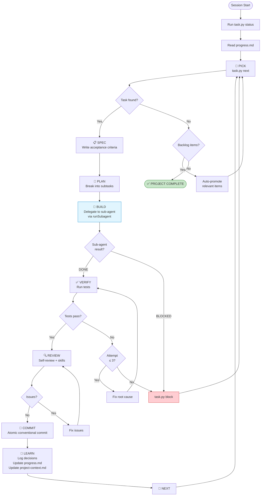
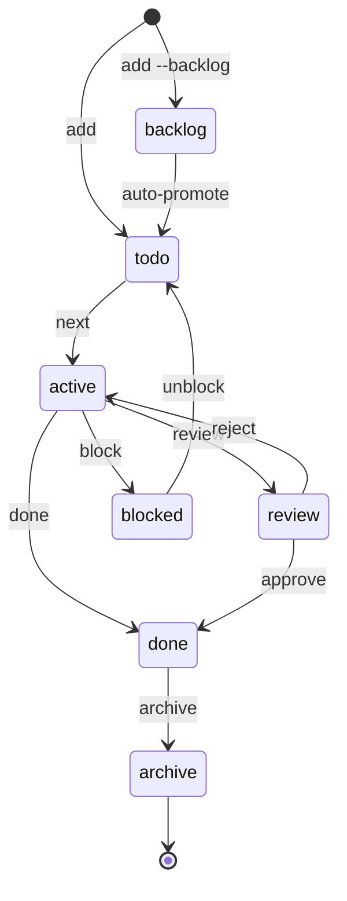

# Agent Harness Creator

A Code Studio skill that scans any repository and generates a tailored `.codestudio/` workspace — giving AI agents a structured loop protocol for task management, implementation, and delivery.

## What It Does

Point it at any repo and it will:

1. **Scan** — detect language, framework, test runner, security patterns, UI files
2. **Interview** — ask clarifying questions (empty repos get full interview mode)
3. **Generate** — create a `.codestudio/` directory with task management and loop protocol
4. **Seed** — populate initial tasks from detected TODOs, issues, or interview answers
5. **Verify** — smoke-test the harness

### Generated Output

```
your-project/
└── .codestudio/
    ├── task.py                    # Task manager script (11 commands)
    ├── codestudio-instructions.md # 9-stage loop protocol
    ├── project-context.md         # Stack, architecture, conventions, boundaries
    ├── tasks/
    │   └── index.json             # Task index (agent never edits directly)
    ├── progress.md                # Session memory across conversations
    └── reviewer.agent.md          # Read-only code reviewer (if >10 files)
```

## The Loop

The agent operates as an **orchestrator** that delegates BUILD work to **sub-agents** via `runSubagent`. This means:
- The orchestrator never exhausts its context window — it stays lean (~5KB per iteration)
- Each task gets a fresh sub-agent with a full context window
- The loop can run across 50+ tasks in a single session

```
PICK → SPEC → PLAN → BUILD (sub-agent) → VERIFY → REVIEW → COMMIT → LEARN → NEXT
```

| Stage | Who | What Happens |
|-------|-----|-------------|
| **PICK** | Orchestrator | `task.py next` — get the next eligible task (dependency-aware) |
| **SPEC** | Orchestrator | Write acceptance criteria in the task file |
| **PLAN** | Orchestrator | Break into subtask checkboxes |
| **BUILD** | **Sub-agent** | Implement subtasks, run tests — fresh context per task |
| **VERIFY** | Sub-agent | Run project tests. Max 3 retries, then report blocked |
| **REVIEW** | Orchestrator | Self-review or delegate to reviewer agent |
| **COMMIT** | Orchestrator | Atomic commit with conventional message |
| **LEARN** | Orchestrator | Log decisions and update progress.md |
| **NEXT** | Orchestrator | Loop back to PICK |

### Loop Flow



### Task State Machine



### Project Context

Every sub-agent receives `project-context.md` — a concise file (~50-100 lines) describing:

- **Stack** — language, framework, key libraries
- **Architecture** — directory layout, layer relationships
- **Conventions** — naming, patterns, error handling
- **Boundaries** — files/dirs that should not be modified

For new projects, this is built from interview answers. For existing repos, it's extracted by scanning source files, directory structure, and config files. Updated during LEARN when architectural decisions change.

### Autonomous Completion

The loop doesn't stop when `todo` tasks run out:
- **Auto-promotes** backlog items that are needed to meet the project spec
- **Discovers** new tasks during build and review (missing tests, error handling)
- **Completes** when all goals are satisfied, verify passes, and backlog is evaluated

## Task Manager

The Python script manages all state so the agent never touches JSON directly:

```bash
python3 .codestudio/task.py next              # pick next eligible task
python3 .codestudio/task.py done              # mark active task complete
python3 .codestudio/task.py add "title"       # add a new task
python3 .codestudio/task.py add "t" --needs T-001  # with dependency
python3 .codestudio/task.py add "t" --backlog      # add to backlog
python3 .codestudio/task.py block "reason"    # can't proceed
python3 .codestudio/task.py unblock T-003     # try again
python3 .codestudio/task.py review            # submit for review
python3 .codestudio/task.py approve           # review passed
python3 .codestudio/task.py reject            # review failed, rework
python3 .codestudio/task.py status            # project summary
python3 .codestudio/task.py list              # list all tasks
python3 .codestudio/task.py archive           # move done tasks to archive
python3 .codestudio/task.py info T-001        # task details
```

**Constraints enforced:**
- Only one active task at a time
- Dependencies must be resolved before a task is picked
- Six statuses: `backlog → todo → active → review → done` (+ `blocked`)

## SDLC Skill Integration

The harness optionally leverages 14 SDLC skills if installed at `~/.agents/skills/`:

| Stage | Skill | When |
|-------|-------|------|
| SPEC | `spec-driven-development` | Complex tasks |
| PLAN | `planning-and-task-breakdown` | Multi-step tasks |
| BUILD | `incremental-implementation` + `test-driven-development` | Always |
| VERIFY | `debugging-and-error-recovery` | On failure |
| REVIEW | `code-review-and-quality` + `security-and-hardening` | Sensitive changes |
| COMMIT | `git-workflow-and-versioning` | Always |
| UI | `frontend-ui-engineering` | UI tasks |

Skills are **optional enhancers** — the harness works standalone without any of them.

The SDLC skills come from [addyosmani/agent-skills](https://github.com/addyosmani/agent-skills). Install them with:

```bash
git clone https://github.com/addyosmani/agent-skills.git ~/.agents/skills
```

## Three Modes

| Mode | Trigger | Behavior |
|------|---------|----------|
| **Empty repo** | No source files | Interview → seed tasks → generate |
| **Existing repo** | Source files found | Auto-detect → confirm → generate |
| **Upgrade** | `.codestudio/` exists | Update scripts, preserve tasks & progress |

## Auto-Detection

The skill detects project characteristics from manifest files:

| Signal | Language | Default Verify Command |
|--------|----------|----------------------|
| `package.json` | Node.js | `npm test` |
| `requirements.txt` | Python | `pytest` |
| `Cargo.toml` | Rust | `cargo test` |
| `*.csproj` | .NET | `dotnet test` |
| `go.mod` | Go | `go test ./...` |
| `pom.xml` | Java | `mvn test` |

Also detects: security patterns (auth, JWT, crypto), UI frameworks, test runners, git presence.

## Installation

Copy or symlink into your skills directory:

```bash
# Clone
git clone https://github.com/praveen-hari/agent-harness-creator.git ~/.agents/skills/harness-creator

# Or symlink if cloned elsewhere
ln -s /path/to/agent-harness-creator ~/.agents/skills/harness-creator
```

## Usage

Tell the agent:
- "set up harness"
- "create harness"
- "bootstrap this project"
- "initialize project tasks"

The skill activates, scans your repo, and generates the `.codestudio/` directory. Then start working:

```bash
python3 .codestudio/task.py next
```

## File Structure

```
~/.agents/skills/harness-creator/
├── SKILL.md                              # Entry point (5-step process)
├── references/
│   ├── loop-protocol.md                  # Loop stages + state machine
│   ├── stages-catalog.md                 # Stage → skill mapping
│   └── detection-rules.md                # Repo scanning logic
└── templates/
    ├── task.py.tmpl                      # Task manager script
    ├── codestudio-instructions.md.tmpl   # Loop protocol template
    ├── project-context.md.tmpl           # Project context template
    ├── index.json.tmpl                   # Empty task index
    ├── progress.md.tmpl                  # Session memory template
    └── reviewer.agent.md.tmpl            # Reviewer agent template
```

## License

MIT
